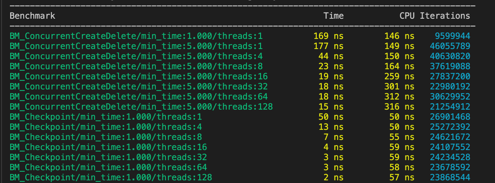

# Thread Liveness Monitor
------------

TLM is production ready C++ library designed to detect deadlocks, livelocks and
starvation at runtime with tiny overhead. The project is sponsored and copyrighted by [MongoDB Inc](http://mongodb.com), author [Andrew Shuvalov](https://www.linkedin.com/in/andrewshuvalov/).

## Sample Usage
  ```c++
  #include "thread_monitor/thread_monitor.h"

  void myLivelockedMethod();

  void myParentMethod() {
    thread_monitor::ThreadMonitor<> monitor("Livelock demo", 1);

    std::this_thread::sleep_for(2ms);
    thread_monitor::threadMonitorCheckpoint(2);
    myLivelockedMethod();
  }

  void myLivelockedMethod() {
    thread_monitor::threadMonitorCheckpoint(3);

    while (true) {
        std::this_thread::sleep_for(1ms);
    }
  }

  ```


  After the timeout configured with `ThreadMonitorCentralRepository::setThreadTimeout()` expires the library will dump the checkpoint history for the stuck thread and then for all other instrumented threads that are stuck for more than *1 millis* (to reduce verbosity):

  ```
Frozen thread: Livelock demo id: 140085845083904
Checkpoint: 1   at: 2021-12-09 23:29:36.201542  delta: 0 us
Checkpoint: 2   at: 2021-12-09 23:29:36.203625  delta: 2083 us
  ```

and then it will invoke the callback registered with `ThreadMonitorCentralRepository::setLivenessErrorConditionDetectedCallback()`. Most likely, you would like to terminate your program when this callback is called.

- Note: if you add a `threadMonitorCheckpoint()` inside the `while()` loop   above, the thread will be considered alive and the *liveness error* will not be triggered.

# Benchmarks

Google benchmarks on Platinum 8275CL CPU @ 3.00GHz, with CPU scaling on:

- first group is registration/derigistration pair, second group is checkpoints

More detailed [benchmarks and optimizations](docs/Benchmarks.md).

# Design

`ThreadMonitor` class to be instantiated on stack, registers itself with singleton of `ThreadMonitorCentralRepository` and with thread local pointer to itself. In the destructor, `~ThreadMonitor()` sets the thread local pointer to `nullptr` and marks itself as deleted at the `ThreadMonitorCentralRepository`.

The TLM requires an explicit instrumentation of threads with global method `threadMonitorCheckpoint()`. Each time this method is invoked, it updates the
liveness timer for the current thread. The method is using the thread local pointer to locate the `ThreadMonitor`, thus it is impossible to update the liveness of another thread.

`ThreadMonitor` must be always deleted by the same thread which created it, otherwise it will be unable to deregister itself and memory corruption will happen.

Some of the configuration parameters could be changed on the `ThreadMonitorCentralRepository` singleton. It is not necessary as the defaults
are reasonable. 

`ThreadMonitor` keeps a circular buffer history of the past visited checkpoints.
The count of checkpoints stored is the class template parameter. The `ThreadMonitor` updates the *stale timestamp* in the central repository as well.
This timestamp is stale because it is updated only as often as configured, for the
performance reasons.

It is possible to instantiate the `ThreadMonitor` more than once in the same thread. Only the 1st instance will have any effect. This is supported for the reason the call tree could be complex and preventing duplicate instantiations could be cumbersome.

## Parameters

- *reporting interval*: how often a thread should update its timestamp in the central repository. The default value of 1 ms should be good for most cases
- *monitoring interval*: how often the central repository monitoring and garbage
  collection cycle should run. It should be reasonably often because the deregistered `ThreadMonitor` instances may accumulate and waste memory. The default value is set to run it relatively often for those cases when there is a
  significant churn of `ThreadMonitor` instances. The monitor cycle is measured to
  take about 1 micros, so it's not a lot of overhead
- *thread timeout*: sets how long the thread should be stale before it is  considered not live anymore (frozen, deadlocked), which triggers the fault procedures. The default value of 5 minutes is recommended for production
- *liveness error condition callback*: a callback that will be invoked once the liveness error is detected. It is recommended to terminate the server when it happens


# Related Work / References

- [Ways to detect deadlock in a live application](https://stackoverflow.com/questions/43622603/ways-to-detect-deadlock-in-a-live-application)
- [Looper: Lightweight Detection of
Infinite Loops at Runtime](https://www.burn.im/pubs/BurnimJalbertStergiouSen-ASE09.pdf)
- [Can a runtime environment detect an infinite loop?](https://cs.stackexchange.com/questions/11645/can-a-runtime-environment-detect-an-infinite-loop)
- [How one thread monitor other thread?](https://stackoverflow.com/questions/59687543/how-one-thread-monitor-other-thread)
- [Code that debugs itself: Fixing a deadlock with a watchdog](https://medium.com/bluecore-engineering/code-that-debugs-itself-fixing-a-deadlock-with-a-watchdog-cd83019cce2e)
- [Thread progress monitoring in Python](https://greenash.net.au/thoughts/2011/06/thread-progress-monitoring-in-python/)
