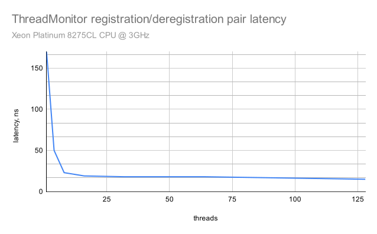
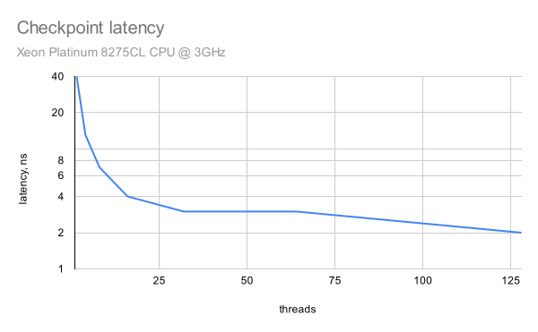

# Thread Liveness Monitor Benchmarks

Compile and run benchmarks with:
```
scons && build/release/thread_monitor/thread_monitor_bm 
```

My results run at *AWS server with Intel(R) Xeon(R) Platinum 8275CL CPU @ 3.00GHz*:

    ---------------------------------------------------------------------------------------------
    Benchmark                                                      Time           CPU Iterations
    ---------------------------------------------------------------------------------------------
    BM_ConcurrentCreateDelete/min_time:5.000/threads:1           174 ns        147 ns   46892012
    BM_ConcurrentCreateDelete/min_time:5.000/threads:4            44 ns        152 ns   42414608
    BM_ConcurrentCreateDelete/min_time:5.000/threads:8            23 ns        160 ns   37855504
    BM_ConcurrentCreateDelete/min_time:5.000/threads:16           28 ns        385 ns   17644800
    BM_ConcurrentCreateDelete/min_time:5.000/threads:32           19 ns        296 ns   30823680
    BM_ConcurrentCreateDelete/min_time:5.000/threads:64           19 ns        289 ns   27746240
    BM_ConcurrentCreateDelete/min_time:5.000/threads:128          16 ns        363 ns   21645952
    BM_ConcurrentCreateDelete/min_time:5.000/threads:1024          6 ns        363 ns   19923968
    BM_Checkpoint/min_time:1.000/threads:1                        50 ns         50 ns   27617528
    BM_Checkpoint/min_time:1.000/threads:4                        13 ns         51 ns   24985056
    BM_Checkpoint/min_time:1.000/threads:8                         7 ns         54 ns   23280840
    BM_Checkpoint/min_time:1.000/threads:16                        4 ns         59 ns   24212928
    BM_Checkpoint/min_time:1.000/threads:32                        3 ns         58 ns   24308928
    BM_Checkpoint/min_time:1.000/threads:64                        2 ns         57 ns   23891520
    BM_Checkpoint/min_time:1.000/threads:128                       2 ns         57 ns   24737152
    BM_Checkpoint/min_time:1.000/threads:1024                      0 ns         59 ns   24121344
    BM_GCAndMonitor/min_time:1.000/threads:1                     555 ns        555 ns    2480512
    BM_GCAndMonitor/min_time:1.000/threads:8                     885 ns       6850 ns     166064
    BM_GCAndMonitor/min_time:1.000/threads:32                    935 ns      12492 ns     114208
    BM_GCAndMonitor/min_time:1.000/threads:64                    813 ns      13152 ns     111744
    BM_GCAndMonitor/min_time:1.000/threads:128                   764 ns      14761 ns     109696
    BM_GCAndMonitor/min_time:1.000/threads:256                   587 ns      16629 ns      87296
    BM_GCAndMonitor/min_time:1.000/threads:512                   528 ns      18631 ns      76288
    BM_GCAndMonitor/min_time:1.000/threads:1024                  934 ns      21214 ns      65536


Indeed, the checkpoint overhead running with 1024 threads dropped below 1 nanosecond **:-)**

Similar results (from another run) plotted:





Benchmark with *clang++* on *Xeon Platinum 8124M CPU @ 3GHz* with CPU scaling off:

    BM_ConcurrentCreateDelete/min_time:5.000/threads:1           131 ns        105 ns   64316131
    BM_ConcurrentCreateDelete/min_time:5.000/threads:4            33 ns        110 ns   64931016
    BM_ConcurrentCreateDelete/min_time:5.000/threads:8            16 ns        115 ns   59496344
    BM_ConcurrentCreateDelete/min_time:5.000/threads:16           23 ns        340 ns   16000000
    BM_ConcurrentCreateDelete/min_time:5.000/threads:32           26 ns        764 ns    9752256
    BM_ConcurrentCreateDelete/min_time:5.000/threads:64           25 ns       1322 ns    6017216
    BM_ConcurrentCreateDelete/min_time:5.000/threads:128          14 ns       1203 ns   10882944
    BM_ConcurrentCreateDelete/min_time:5.000/threads:1024          6 ns        911 ns   13067264
    BM_Checkpoint/min_time:1.000/threads:1                        33 ns         33 ns   42841376
    BM_Checkpoint/min_time:1.000/threads:4                         8 ns         33 ns   41923824
    BM_Checkpoint/min_time:1.000/threads:8                         4 ns         33 ns   41902976
    BM_Checkpoint/min_time:1.000/threads:16                        2 ns         39 ns   35306640
    BM_Checkpoint/min_time:1.000/threads:32                        1 ns         40 ns   35306304
    BM_Checkpoint/min_time:1.000/threads:64                        1 ns         40 ns   36358656
    BM_Checkpoint/min_time:1.000/threads:128                       1 ns         40 ns   36180096
    BM_Checkpoint/min_time:1.000/threads:1024                      0 ns         38 ns   34639872

-------

## Performance related optimizations used in this project

- Please read the [design](../README.md)

### Central repository container

Using [plf::colony](https://plflib.org/) collection that offers stable memory location
and continuous memory allocation. The *std::* containers are either pointer-stable (map, list) or continuous memory (vector, deque).

This allows the *ThreadMonitor* automatic RAII instance to register itself in *plf::colony* central repository and save the pointer to this registration. The registration pointer is used by checkpoints to occasionally update the liveness timestamp, and by deregistration.
